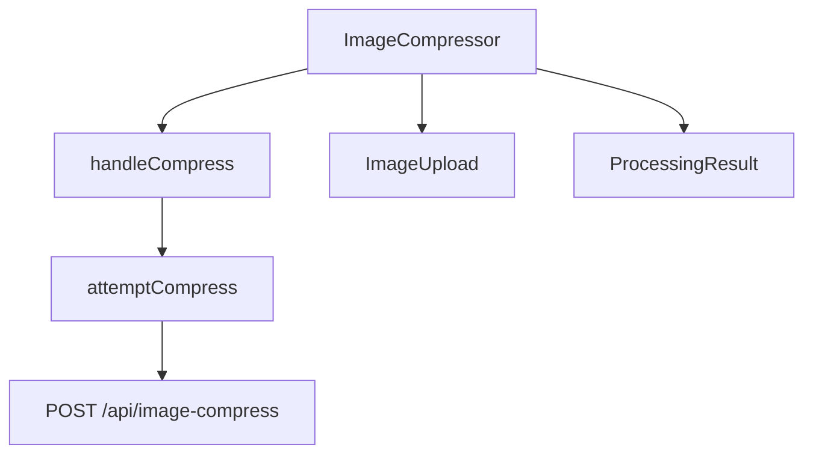

# CodeAtlas — Complete System Architecture Guide
*For learning, understanding, and placement preparation*

---

## Table of Contents

1. [What Is CodeAtlas?](#1-what-is-codeatlas)
2. [The Core Problem — Why Standard RAG Fails for Code](#2-the-core-problem--why-standard-rag-fails-for-code)
3. [Tech Stack — Every Tool Explained with Reasoning](#3-tech-stack--every-tool-explained-with-reasoning)
4. [What Is an AST? (Simple Explanation First)](#4-what-is-an-ast-simple-explanation-first)
5. [End-to-End Backend Flow — The Big Picture](#5-end-to-end-backend-flow--the-big-picture)
6. [Deep Dive: AST Chunking](#6-deep-dive-ast-chunking)
7. [Deep Dive: Metadata — What, Why, How](#7-deep-dive-metadata--what-why-how)
8. [Deep Dive: Embeddings Pipeline](#8-deep-dive-embeddings-pipeline)
9. [Deep Dive: Pinecone Storage](#9-deep-dive-pinecone-storage)
10. [The 4 Query Modes — How Each Works](#10-the-4-query-modes--how-each-works)
11. [Multi-Hop Retrieval — The Core Innovation](#11-multi-hop-retrieval--the-core-innovation)
12. [LangChain — Used Selectively, Not as a Religion](#12-langchain--used-selectively-not-as-a-religion)
13. [LLM Prompt Engineering](#13-llm-prompt-engineering)
14. [Frontend Architecture](#14-frontend-architecture)
15. [Backend Folder Structure Explained](#15-backend-folder-structure-explained)
16. [Key Design Decisions & Trade-offs](#16-key-design-decisions--trade-offs)
17. [Interview & Placement Talking Points](#17-interview--placement-talking-points)

---

## 1. What Is CodeAtlas?

**CodeAtlas is an AI-powered codebase intelligence tool.**

Here's what it does in plain English:

1. A user pastes a public GitHub URL (e.g., `https://github.com/someone/my-app`)
2. The backend **clones** the repository
3. It **reads and understands** every source file using a real TypeScript compiler (not just text search)
4. It extracts every **function, class, React component, and their relationships** (who calls who, which component renders which)
5. All of this gets stored in a **vector database** (Pinecone)
6. The user gets a **chat interface** where they can ask questions, trace code flows, and generate architecture diagrams

**The key difference from basic AI code tools:**

Most tools just read code as plain text. CodeAtlas *understands the structure*. It knows that `loginUser()` calls `AuthService.login()` which hits `/api/auth`. It stores those relationships. When you ask "how does login work?", it follows that chain and gives you a precise, accurate answer — not a guess.

---

## 2. The Core Problem — Why Standard RAG Fails for Code

### What is Standard RAG?

RAG stands for **Retrieval-Augmented Generation**. The basic idea:

```
Document → Split into 500-character chunks → Convert to numbers (embed) → Store
User asks question → Convert question to numbers → Find most similar chunks → Give to AI → Get answer
```

This works well for documents like PDFs and articles. It **fails badly for code**.

### Why RAG Breaks for Code

Think of code like a recipe that spans multiple pages of a cookbook, where each step references another recipe in a different chapter. If you randomly cut the cookbook into 500-character pieces, you'll lose the connections between steps.

| Problem | What Happens |
|---|---|
| **Function cut in half** | The text splitter hits the 500-char limit mid-function. The AI gets an incomplete function |
| **No relationship knowledge** | The AI doesn't know that `loginUser()` calls `findUser()` in another file |
| **Missing dependencies** | The relevant chunk for a dependency wasn't in the top-10 search results |
| **Hallucination** | AI makes up the missing parts because it doesn't have complete context |

### Our Solution

```
Code → AST Parser → Extract COMPLETE functions/classes/components
     → Store relationship metadata (who calls who, what API it hits, what it renders)
     → On query: vector search for entry point + follow the dependency chain
     → AI gets the COMPLETE execution graph → Precise, accurate answer
```

---

## 3. Tech Stack — Every Tool Explained with Reasoning

### Backend

| Technology | What It Does | Why This, Not Something Else |
|---|---|---|
| **Node.js + Express** | REST API server | Lightweight, non-blocking I/O — perfect for API-heavy work |
| **TypeScript** | Type-safe development | Catches bugs before they run. Matches the frontend stack |
| **ts-morph** | TypeScript Compiler API wrapper | Gives us the *exact same* AST the `tsc` compiler uses. Regex cannot match this |
| **HuggingFace Inference API** | Generates 384-dim vector embeddings | Free tier. `BAAI/bge-small-en-v1.5` is purpose-built for retrieval |
| **Pinecone Serverless** | Vector database | Stores embeddings + metadata. Supports `$in` metadata filter — critical for multi-hop |
| **Groq + Llama-3.3-70b** | LLM for generating answers | 10–20× faster than GPT-4 because Groq uses custom LPU hardware |
| **LangChain (`@langchain/groq`)** | LLM abstraction | Clean `SystemMessage` + `HumanMessage` format. Only used here — not for embeddings or Pinecone |
| **simple-git** | Git operations | Programmatic shallow clone (`--depth 1`) — only latest code, not full history |
| **Zod** | Request validation | Runtime type checking for API inputs. Throws structured errors |
| **rimraf** | Disk cleanup | Deletes cloned repo after indexing. Without this, server disk fills up fast |

### Frontend

| Technology | Why |
|---|---|
| **Next.js 16 App Router** | File-based routing, `[namespace]/chat` dynamic routes |
| **Tailwind CSS + shadcn/ui** | Professional UI without writing custom CSS from scratch |
| **Zustand** | Simpler than Redux — no Provider wrapper, no reducers |
| **Axios** | Cleaner than `fetch` — timeout, interceptors, base URL config |
| **react-markdown** | Renders AI's markdown response (headers, bullets, code blocks) |
| **react-syntax-highlighter** | Syntax-highlighted code blocks inside chat messages |
| **Mermaid.js** | Converts AI-generated diagram text into actual SVG visuals |
| **React Flow** | Drag-and-drop node graph for exploring codebase architecture visually |
| **Three.js** | 3D animated particle canvas on the landing page |

---

## 4. What Is an AST? (Simple Explanation First)

### The Simple Analogy

When you read the sentence *"The dog chased the cat"*, your brain doesn't just see letters — it automatically understands the structure: subject (*dog*), verb (*chased*), object (*cat*). You can answer "Who did the chasing?" instantly.

An AST does the same for code. It's not just raw text — it's a structured understanding of what the code *means*.

**AST = Abstract Syntax Tree** — a tree-shaped data structure that represents every piece of code as typed, named nodes.

### The Technical Example

Given this TypeScript code:

```typescript
function loginUser(email: string) {
  const user = findUserByEmail(email);
  return AuthService.createToken(user);
}
```

The AST looks like this:

```
FunctionDeclaration
  name: "loginUser"
  parameters: [email: string]
  body: Block
    ├── VariableStatement
    │     name: "user"
    │     value: CallExpression → "findUserByEmail"
    └── ReturnStatement
          CallExpression → "AuthService.createToken"
            argument: "user"
```

The AST is a *data object*, not text. You can ask it precise questions:
- "What is the name of this function?" → `loginUser`
- "What functions does it call?" → `findUserByEmail`, `AuthService.createToken`
- "Where does it start and end (line numbers)?" → Line 1 to Line 4
- "Is this a React component?" → Check if the name is PascalCase in a `.tsx` file

**None of this is possible reliably with text search or regex.**

### Why Not Just Use Regex?

```
/function\s+(\w+)/   → works for: function login() {}
                      → breaks for: const login = () => {}
                      → breaks for: export default function() {}
                      → breaks for: const Login = memo(() => {})
                      → breaks for: async function login() {}
```

Regex breaks the moment code doesn't match the exact pattern. AST handles all of these because it understands the *meaning*, not just the characters.

---

## 5. End-to-End Backend Flow — The Big Picture

Here's the complete journey from when a user submits a GitHub URL to when the data is ready to query:

```
User submits GitHub URL
         ↓
POST /api/v1/repos/analyze
         ↓
[STEP 1]  Validate URL → Generate repoId (UUID) → this becomes Pinecone namespace
         ↓
[STEP 2]  simple-git → shallow clone into tmp/repos/{repoId}/
         ↓
[STEP 3]  Walk directory tree → skip junk files → collect source files
         ↓
[STEP 4]  For each file:
          .ts/.tsx/.js/.jsx → AST chunking (ts-morph)
          Everything else   → Line-based chunking (max 1500 chars)
         ↓
[STEP 5]  Extract metadata from each chunk
          (functionCalls, componentDependencies, hooksUsed, apiCalls, imports, exports)
         ↓
[STEP 6]  Filter out noise (console.log, Math.floor, JSON.parse, etc.)
         ↓
[STEP 7]  embedTexts(all chunk contents)
          → Batches of 32, 3 concurrent workers, retry on rate limit
          → 384-dim vector per chunk
         ↓
[STEP 8]  pinecone.upsert(records)
          → Batches of 100, 5 concurrent workers
          → Each record: { id, vector, metadata }
          → All stored in namespace = repoId
         ↓
[STEP 9]  Build summary.json and save to disk
         ↓
[STEP 10] rimraf → delete tmp/repos/{repoId}/
         ↓
Return success response to frontend
```

**Concurrency note:** Files are processed 10 at a time (not one by one). This makes indexing significantly faster for large repos.

### Step 1 — Repository Intake (Clone)

**File:** `src/services/repository.service.ts`

- URL is validated: must be `github.com` format with owner + repo name
- `crypto.randomUUID()` generates a unique `repoId` — this UUID becomes the **Pinecone namespace** that isolates this repo from all others
- `simple-git` runs a **shallow clone** (`--depth 1`) — downloads only the latest snapshot, not full git history

### Step 2 — File Scanning & Smart Filtering

**File:** `src/indexing/scanner/repository-scanner.ts`

**Directories it skips entirely:**
```
node_modules, .git, dist, build, .next, coverage, .turbo, .cache
```

**Individual files it skips:**
```
package-lock.json, yarn.lock, tsconfig.json, next.config.js, .env, *.lock
```

**File types it accepts:**
```
.ts, .tsx, .js, .jsx  → code files → AST chunking
.json, .md, .html, .css, .py → other files → line-based chunking
```

### Step 3 — AST Chunking

**File:** `src/indexing/chunker/code-chunker.ts`

For `.ts/.tsx/.js/.jsx` files, the code is passed to `ts-morph` which parses it into a full AST. The chunker walks the top-level statements and extracts:

- `FunctionDeclaration` → one chunk (the whole function)
- `ClassDeclaration` → one chunk for the class + one chunk per method
- `VariableStatement` with `ArrowFunction` → detected and chunked properly
- Everything else (imports, types, constants) → one "module" chunk per file

### Step 4 — Metadata Extraction

For every code chunk, the chunker walks AST nodes and collects:

| Field | What it captures | Example |
|---|---|---|
| `symbolName` | The primary name of this chunk | `"AuthService.login"` |
| `functionCalls` | Every function this code calls | `["findUserByEmail", "bcrypt.compare"]` |
| `componentDependencies` | React components this renders | `["Button", "Modal", "AuthDialog"]` |
| `hooksUsed` | React hooks used | `["useState", "useEffect"]` |
| `apiCalls` | API endpoints called | `["/api/auth/login"]` |
| `imports` | What this file imports | `["react", "axios"]` |
| `exports` | What this file exports | `["AuthService"]` |
| `kind` | Type of chunk | `"component"`, `"function"`, `"class"`, `"method"` |
| `startLine` / `endLine` | Exact line numbers | `12`, `28` |

### Step 5 — Noise Filtering

Raw AST extraction picks up *everything* — including `Math.floor`, `console.log`, `JSON.parse`. These are JavaScript built-ins, not application code. They're removed using an ignore list:
```
Math, Object, Array, String, Number, JSON, Date, console, Promise, Error,
window, document, localStorage, sessionStorage, setTimeout, setInterval
```

### Step 6 — Embedding Generation

**File:** `src/indexing/embeddings/embedding.service.ts`

Every chunk's text is converted to a 384-dimensional vector. Why batching?
```
Naive:  300 chunks × 1 API call each × 700ms = 210 seconds ❌
Ours:   300 chunks → batches of 32 → 3 concurrent → ~23 seconds ✅
```

### Step 7 — Pinecone Upsert

**File:** `src/vectorstore/pinecone.service.ts`

Each chunk becomes a Pinecone record:
```
id:       "repoId:filePath:chunkIndex"
values:   [0.023, -0.047, ...]       → 384-dim vector
metadata: { symbolName, functionCalls, content, filePath, ... }
```
Upserted in batches of 100 with 5 concurrent workers.

### Step 8 — Summary Generation

A lightweight `summary.json` is built and saved to disk, categorizing:
- Files in `app/**/page.tsx` → **pages**
- Files in `components/` → **components**
- Files in `hooks/` or symbols starting with `use` → **hooks**
- Files in `services/` → **services**
- Files in `api/` or `routes/` → **API routes**

Used only by `overview` mode — no vector search needed.

### Step 9 — Cleanup

`rimraf` deletes `tmp/repos/{repoId}/`. Runs inside `try/finally` — cleanup happens even if indexing fails midway.

---

## 6. Deep Dive: AST Chunking

**File:** `src/indexing/chunker/code-chunker.ts`

### How a File Gets Parsed

```typescript
const project = new Project({ useInMemoryFileSystem: true });
const sourceFile = project.createSourceFile(`temp.tsx`, content, {
  scriptKind: ScriptKind.TSX
});
```

`ts-morph` creates a **virtual TypeScript project in memory** — no real files, no tsconfig needed.

### What Each Node Type Produces

**1. Function Declaration**
```typescript
function renderTask(task) {
  const li = document.createElement("li");
  taskList.appendChild(li);
}
```
→ One chunk. `kind: "function"`. If name is PascalCase and file is `.tsx`/`.jsx` → `kind: "component"`.

**2. Class Declaration — produces MULTIPLE chunks**
```typescript
class AuthService {
  login() { ... }
  register() { ... }
}
```
→ Chunk 1: Entire class. `kind: "class"`, `symbolName: "AuthService"`.
→ Chunk 2: `login` method. `kind: "method"`, `symbolName: "AuthService.login"`.
→ Chunk 3: `register` method. `kind: "method"`, `symbolName: "AuthService.register"`.

*Why both the class AND methods?* The class gives full context. The methods allow precise retrieval — "how does login work?" gets exactly the login method, not the whole class.

**3. Arrow Function Variables — all handled correctly**
```typescript
const ProductCard = () => { return <div/> }            // basic arrow
const ProductCard = memo(() => { return <div/> })      // wrapped in memo
const Foo: React.FC<Props> = () => { ... }             // typed as React.FC
```
All detected by `getFunctionVariableInfo()`. Wrapped in `memo()`, `forwardRef()`, `lazy()`, `observer()` → `kind: "component"`.

**4. React Component Detection Rule**
Two conditions BOTH must be true:
- Name is PascalCase (`/^[A-Z][A-Za-z0-9]*$/`)
- File extension is `.tsx` or `.jsx`

**5. Module Chunk — the "everything else" bucket**
Imports, type declarations, constants, interfaces → all collected into one `kind: "module"` chunk per file. If under 100 chars, merged into the previous chunk.

**6. Oversized Chunks**
If any chunk exceeds 1500 chars, it's split by lines. **Metadata is preserved on every sub-chunk** — symbolName, functionCalls, etc. carry through.

### Chunk ID Format
```
{repoId}:{filePath}:{chunkIndex}
Example: b45c9245-f22e:src/auth.ts:3
```

---

## 7. Deep Dive: Metadata — What, Why, How

This is what a full metadata object looks like inside Pinecone:

```json
{
  "repoId": "b45c9245-f22e-4755-b1a8-c9903f3f041b",
  "repoName": "my-app",
  "filePath": "src/services/auth.service.ts",
  "fileName": "auth.service.ts",
  "extension": ".ts",
  "language": "typescript",
  "directory": "src/services",

  "kind": "method",
  "symbolName": "AuthService.login",
  "chunkIndex": 4,
  "startLine": 12,
  "endLine": 28,

  "content": "login(email, password) { ... full method body ... }",
  "contentLength": 342,

  "imports": ["bcrypt", "jsonwebtoken", "./user.model"],
  "exports": ["AuthService"],

  "functionCalls": ["bcrypt.compare", "jwt.sign", "findUserByEmail"],
  "componentDependencies": [],
  "hooksUsed": [],
  "apiCalls": []
}
```

### Why Each Field Matters

| Field | Why We Store It |
|---|---|
| `content` | The AI needs the actual code to answer questions |
| `symbolName` | Powers multi-hop — we query `{ symbolName: { $in: ["login"] } }` to fetch this exact chunk |
| `functionCalls` | Multi-hop: `login` calls `findUserByEmail`, so we fetch that chunk too in the second query |
| `componentDependencies` | Multi-hop for React: `ProductCard` renders `<Button>` and `<Modal>`, fetch those too |
| `hooksUsed` | Tells the AI which React hooks this component depends on |
| `apiCalls` | Tells the AI which API endpoints this code calls |
| `imports` | Shows external and internal dependencies |
| `exports` | Shows what this file exposes to the rest of the codebase |
| `startLine` / `endLine` | Frontend can show "go to line X" links |
| `kind` | Enables filtering: "show all React components", "show all API routes" |

---

## 8. Deep Dive: Embeddings Pipeline

**File:** `src/indexing/embeddings/embedding.service.ts`

### What is an Embedding?

An embedding is a list of numbers (a **vector**) that represents the *meaning* of text. Two texts with similar meaning will have vectors that are close together in mathematical space.

```
"login function"     → [0.12, -0.45, 0.33, ...]   (384 numbers)
"authenticate user"  → [0.11, -0.44, 0.35, ...]   ← very close = high similarity
"render a button"    → [-0.87, 0.21, -0.14, ...]  ← far away = low similarity
```

This is how semantic search works — find chunks whose *meaning* is closest to the user's question.

### Model: BAAI/bge-small-en-v1.5

- BGE = BAAI General Embedding — designed for retrieval, not generation
- **384 dimensions** — small enough to be fast, large enough for excellent accuracy
- **Free** via HuggingFace Inference API
- Comparable to OpenAI's `text-embedding-3-small` (1536-dim, paid) for code search tasks

### The Batching + Worker Pool Strategy

**Naive approach (wrong):**
```typescript
for (const chunk of chunks) {
  await embedText(chunk);  // one API call per chunk
}
// 300 chunks × 700ms = 210 seconds ❌
```

**Worker pool approach (right):**
```typescript
// Split into batches of 32 (HuggingFace supports array input)
const batches = splitIntoBatches(texts, 32);
let nextBatch = 0;

async function worker() {
  while (nextBatch < batches.length) {
    const i = nextBatch++;  // each worker claims the next unclaimed batch
    results[i] = await embedBatch(batches[i]);
  }
}

// Run 3 workers simultaneously
await Promise.all([worker(), worker(), worker()]);
// 300 chunks → 10 batches → ~4 rounds with 3 concurrent workers = ~23 seconds ✅
```

**Why worker pool instead of `Promise.all` on all batches?**
`Promise.all` on 300 items launches 300 requests at once → **HTTP 429 rate limit immediately**. The worker pool keeps exactly 3 requests in flight — steady throughput, no rate limit hits.

### Retry Logic

```typescript
for (let attempt = 1; attempt <= 3; attempt++) {
  try {
    return await embedBatch(texts);
  } catch (err) {
    if (err.status === 429) {
      await sleep(1000 * attempt);   // wait 1s, then 2s, then 3s
    } else {
      throw err;  // non-rate-limit error — don't retry
    }
  }
}
```

### Query Time Embedding (Different)

At query time, only ONE text needs to be embedded. No batching needed:

```typescript
export async function embedQuery(text: string): Promise<number[]> {
  const result = await hfClient.featureExtraction({
    model: "BAAI/bge-small-en-v1.5",
    inputs: text,    // single string, not array
  });
  return result as number[];
}
```

---

## 9. Deep Dive: Pinecone Storage

**File:** `src/vectorstore/pinecone.service.ts`

### Record Structure

Every chunk becomes exactly one Pinecone record with 3 fields:

```
{
  id:       "b45c9245:src/auth.ts:3"   ← globally unique
  values:   [-0.048, 0.021, ...]       ← 384-dim vector
  metadata: { all AST fields... }      ← everything from Section 7
}
```

### Namespaces — Repository Isolation

Every repository gets its own **namespace** equal to its `repoId` UUID.
- Querying namespace `abc` **never touches** data from namespace `xyz`
- Multiple repos can live in the same Pinecone index
- Deleting a repo = just deleting its namespace

### Two Types of Pinecone Queries

**Type 1: Vector Similarity Search** — "find code similar to this question"
```typescript
await index.query({
  vector: queryEmbedding,   // user's question as a 384-dim vector
  topK: 10,
  includeMetadata: true,
});
```

**Type 2: Metadata Filter Search** — "fetch these specific chunks by name"
```typescript
await index.query({
  vector: new Array(384).fill(0.0001),  // dummy vector — we don't care about similarity
  topK: symbols.length * 2,
  includeMetadata: true,
  filter: { symbolName: { $in: ["loginUser", "AuthService", "findUserByEmail"] } },
});
```

Type 2 is the **"hop"** in Multi-Hop Retrieval. It fetches dependency chunks by exact name without re-embedding anything.

*Why a dummy vector?* Pinecone's API always requires a vector. Since we only care about the metadata filter, we pass a tiny non-zero value and ignore the similarity scores.

### Similarity Threshold

After vector search, results below `0.65` cosine similarity are discarded:
```typescript
const relevant = matches.filter(m => m.score > 0.65);
```
This prevents low-quality tangentially related chunks from polluting the AI's context.

---

## 10. The 4 Query Modes — How Each Works

Every query first validates the namespace exists in Pinecone. If not → 404 immediately.

### Mode 1: `chat` — Natural Language Q&A

**When to use:** "How does task rendering work?", "What does AuthService do?"

```
User question → embedQuery() → 384-dim vector
    → Pinecone vector search → top 10 most similar chunks
    → Filter: score > 0.65
    → Format context: FILE | TYPE | SYMBOL | LINES | CODE
    → Send to Groq LLM with chat system prompt
    → Return: { answer, sources }
```

**System prompt:** Two-tier answer — plain English summary first, then technical deep-dive with file names and snippets.

---

### Mode 2: `overview` — Architecture Report

**When to use:** "Give me an overview of this repo"

```
User question
    → Load data/summaries/{namespace}.json from disk
    → Send JSON directly to Groq LLM (NO Pinecone query at all)
    → LLM generates: Purpose, Technologies, Features, Architecture, Pages, Components, API Routes
    → Return: { answer, sources: [] }
```

**Why skip vector search?** For a global overview you need the *complete picture* — not just the 10 most similar fragments. The summary JSON captures the entire project structure. Vector search would give an incomplete, biased view.

---

### Mode 3: `flow` — Execution Trace

**When to use:** "How does image compression work?", "Trace the login flow"

```
User question → embedQuery() → vector
    → Pinecone vector search → top 3 entry points (tighter than chat's 10)
    → Filter: score > 0.65
    ── MULTI-HOP ──
    → Read functionCalls + componentDependencies from each entry chunk's metadata
    → Pinecone metadata filter: { symbolName: { $in: [...dependencies...] } }
    → Merge entry chunks + dependency chunks, deduplicate by ID
    → Build rich context (CALLS, DEPS, HOOKS, API CALLS)
    → Send to Groq with flow system prompt
    → Return: arrow diagram + step-by-step explanation
```

---

### Mode 4: `diagram` — Mermaid Architecture Diagram

**When to use:** "Show me a diagram of the compression feature"

**Retrieval:** Identical to `flow` mode — same multi-hop algorithm.

**Only difference:** System prompt tells the LLM to output a `mermaid` code block.

**Example LLM output:**
````

````

The frontend detects the ` ```mermaid ``` ` block and renders it as an interactive SVG using Mermaid.js.

---

## 11. Multi-Hop Retrieval — The Core Innovation

**File:** `src/retrieval/retrieval.service.ts`

### The Problem It Solves

```
User asks: "How does the compression API work?"

Standard RAG top-3 results:
  1. ImageCompressor component     (score: 0.89)  ✅
  2. ProcessingResult component    (score: 0.71)  ✅
  3. Some unrelated utility        (score: 0.66)  ❌

MISSING: attemptCompress(), handleCompress(), /api/image-compress route
→ AI hallucinates the missing logic ❌
```

### With Multi-Hop

```
Step 1: Entry points from vector search → [ImageCompressor, ProcessingResult]

Step 2: Read their metadata:
  ImageCompressor.functionCalls  = ["handleCompress", "attemptCompress"]
  ImageCompressor.componentDeps  = ["ImageUpload"]

Step 3: Fetch those exact chunks via metadata filter:
  { symbolName: { $in: ["handleCompress", "attemptCompress", "ImageUpload"] } }
  → No vector similarity needed — exact match by name

Step 4: Merge + deduplicate
  Final = ImageCompressor + ProcessingResult + handleCompress + attemptCompress + ImageUpload

Step 5: AI has the COMPLETE execution graph → accurate, hallucination-free answer ✅
```

### The Full Algorithm

```
STEP 1 → Vector search → top 3 entry points (score > 0.65)
STEP 2 → Read functionCalls + componentDependencies from each entry chunk
STEP 3 → Collect all dependency names into a Set (avoid duplicates)
STEP 4 → Pinecone metadata filter query with dummy vector
STEP 5 → Merge entry chunks + hop chunks → deduplicate by chunk ID
STEP 6 → Build structured context string with all metadata fields
STEP 7 → Send to LLM
```

### Why This Is Better Than Standard RAG

| Standard RAG | Multi-Hop RAG |
|---|---|
| One vector search, one pass | Vector search + graph traversal via metadata |
| Misses dependencies not in top-K | Explicitly fetches all dependencies |
| Hallucinates missing context | Complete graph = no hallucination |

---

## 12. LangChain — Used Selectively, Not as a Religion

**File:** `src/ai/ai.service.ts`

This section shows *thoughtful* architectural decision-making — something interviewers love.

### Where LangChain IS Used

```typescript
import { ChatGroq } from "@langchain/groq";
import { HumanMessage, SystemMessage } from "@langchain/core/messages";

const model = new ChatGroq({
  apiKey: process.env.GROQ_API_KEY,
  model: "llama-3.3-70b-versatile",
  temperature: 0.1,
});

const response = await model.invoke([
  new SystemMessage(systemPrompt),
  new HumanMessage(userQuery),
]);
```

LangChain is used **only for LLM invocation** with Groq.

**Why it's worth it here:**
1. `ChatGroq` is a typed, maintained client with built-in error handling
2. `SystemMessage` + `HumanMessage` are cleaner than raw `{role, content}` objects
3. To switch from Groq to OpenAI later → just change `ChatGroq` to `ChatOpenAI`. Everything else stays the same

### Where LangChain is NOT Used — And Why

**HuggingFace Embeddings → Direct SDK, not LangChain**

```typescript
// What we do (direct SDK):
import { HfInference } from "@huggingface/inference";
const result = await hfClient.featureExtraction({ model, inputs: texts }); // texts is an ARRAY

// What we DON'T do (LangChain wrapper):
// → Calls the API ONE text at a time. No batch support.
// → 300 chunks × 700ms = 3.5 minutes
// → Our approach: 300 chunks in ~23 seconds (8× faster)
```

**Pinecone → Direct SDK, not LangChain**

```typescript
// What we do:
await index.query({
  vector, topK, includeMetadata: true,
  filter: { symbolName: { $in: [...] } }   // ← multi-hop requires this
});

// What we DON'T do (LangChain PineconeStore):
// → Abstracts away metadata control
// → The $in metadata filter for multi-hop is IMPOSSIBLE through LangChain's wrapper
// → The entire multi-hop algorithm would break
```

**Text Splitting → Custom AST Chunker, not LangChain**

LangChain's `RecursiveCharacterTextSplitter` splits by character count — destroys function bodies, loses all relationships.

### Summary Table

| Operation | What We Use | Why Not LangChain |
|---|---|---|
| LLM invocation (Groq) | `@langchain/groq` ChatGroq | ✅ LangChain IS used here |
| HuggingFace embeddings | Direct `@huggingface/inference` SDK | No batch support → 8× slower |
| Pinecone upsert | Direct `@pinecone-database/pinecone` | Need full metadata control |
| Pinecone search | Direct Pinecone SDK | Need `$in` filter for multi-hop |
| Text splitting | Custom AST chunker (`ts-morph`) | LangChain splitters destroy code structure |

**The principle:** Use LangChain where it adds value. Bypass it where it adds constraints.

---

## 13. LLM Prompt Engineering

**File:** `src/ai/ai.service.ts`

The AI receives two things:
1. **SystemMessage** — its role and output format
2. **HumanMessage** — user's question + retrieved code context

`temperature: 0.1` — near-zero randomness. Code analysis needs deterministic, factual answers.

### System Prompts Per Mode

**chat mode:**
```
You are an expert AI software architect and codebase assistant.
Answer ONLY using the repository context provided below.
Structure your response:
  1. 🎯 High-Level Summary (plain English, non-technical)
  2. 🛠️ Technical Deep Dive (file names, functions, code flow, snippets)
```

**overview mode:**
```
You are an expert software architect.
Generate a comprehensive repository overview from the JSON metadata.
Include: Purpose, Technologies, Major Features, Architecture,
Pages, Components, API Routes.
```

**flow mode:**
```
You are an expert software architect and flow tracer.
Structure your response:
  1. 🗺️ Flow Diagram: visual arrow map (LoginPage ↓ handleLogin() ↓ AuthService.login())
  2. 📖 Step-by-Step: files, functions, and data at each step
```

**diagram mode:**
```
You are an expert software architect.
  1. One sentence describing what the diagram shows
  2. A valid mermaid flowchart code block showing dependencies,
     function calls, API calls, and component hierarchy
```

### Why Mode-Specific Prompts?

One generic prompt produces generic output. Targeted prompts produce:
- `chat` → structured two-tier explanation
- `overview` → full architectural report
- `flow` → visual arrow diagram + numbered steps
- `diagram` → syntactically valid, renderable Mermaid code

---

## 14. Frontend Architecture

### State Management (Zustand)

**File:** `src/store/use-app-store.ts`

**Why Zustand over Redux?**
- No Provider wrapper — just `import { useAppStore }` anywhere
- No reducers, no actions, no dispatch boilerplate
- Works exactly like a regular React hook

**Store shape:**
```typescript
interface AppState {
  activeRepo: IndexedRepository | null;   // full /analyze response
  repoSummary: RepoSummary | null;        // from /summary — feeds React Flow canvas
  isIndexing: boolean;
  messages: ChatMessage[];
  isStreaming: boolean;
  activeMode: "chat" | "overview" | "flow" | "diagram";
  isSidebarOpen: boolean;
  activeView: "chat" | "canvas";
}
```

**Persistence:** `activeRepo` (with its namespace) is saved to `localStorage`. User refreshes → still connected to their repo. Only `activeRepo` is persisted — messages reset on refresh intentionally.

### How a Chat Message Flows

```typescript
// 1. User sends a message
addMessage({ role: "user", content: query, mode: activeMode });
setStreaming(true);

// 2. API call
const { data } = await api.chat(activeRepo.namespace, query, activeMode);

// 3. AI response added
addMessage({ role: "assistant", content: data.data.answer, mode: data.data.mode });
setStreaming(false);
```

### Rendering Each Mode

All 4 modes return markdown. The renderer uses `react-markdown` with a custom `code` component:

```tsx
<ReactMarkdown
  components={{
    code({ className, children }) {
      const language = /language-(\w+)/.exec(className)?.[1];

      if (language === "mermaid") {
        return <MermaidRenderer chart={String(children)} />;
      }

      return (
        <SyntaxHighlighter style={oneDark} language={language}>
          {String(children)}
        </SyntaxHighlighter>
      );
    },
  }}
>
  {message.content}
</ReactMarkdown>
```

| Mode | How It Looks |
|---|---|
| `chat` | Standard markdown — headers, bullets, syntax-highlighted code blocks |
| `overview` | Wide full-width markdown report |
| `flow` | Markdown with ↓ arrows — LLM formats naturally |
| `diagram` | MermaidRenderer intercepts ` ```mermaid ``` ` and renders SVG inline |

### MermaidRenderer

```tsx
mermaid.initialize({ startOnLoad: false, theme: "dark" });

useEffect(() => {
  mermaid
    .render(`mermaid-${uniqueId}`, chart)
    .then(({ svg }) => { containerRef.current.innerHTML = svg; })
    .catch(() => { containerRef.current.innerHTML = `<pre>${chart}</pre>`; });
}, [chart]);
```

`"use client"` required — Mermaid uses browser DOM APIs, cannot run server-side in Next.js.

### React Flow Canvas

When `activeView === "canvas"`, `repoSummary` is mapped into React Flow nodes in columns:

```
Pages       → x=0      → yellow-green border
Components  → x=300    → amber border
Hooks       → x=600    → muted amber border
Services    → x=900    → cream border
API Routes  → x=1200   → yellow-green border
```

Nodes stack vertically within each column (`y = index × 80`). Prevents all nodes spawning at (0,0).

---

## 15. Backend Folder Structure Explained

```
backend/src/
│
├── ai/
│   └── ai.service.ts              ← LangChain ChatGroq + all 4 system prompts
│
├── controllers/
│   ├── chat.controller.ts         ← validate → call service → return response
│   ├── indexing.controller.ts
│   └── repository.controller.ts
│
├── indexing/
│   ├── chunker/
│   │   └── code-chunker.ts        ← THE HEART: ts-morph AST parsing + metadata
│   ├── embeddings/
│   │   └── embedding.service.ts   ← HuggingFace batching + worker pool + retries
│   └── scanner/
│       └── repository-scanner.ts  ← recursive file walker + filters
│
├── middlewares/
│   └── error-handler.ts           ← catches ApiError + Zod errors → clean JSON
│
├── retrieval/
│   └── retrieval.service.ts       ← multi-hop algorithm (entry + hop query)
│
├── routes/
│   ├── chat.routes.ts             ← POST /api/v1/repos/:namespace/chat
│   ├── indexing.routes.ts         ← POST /api/v1/repos/analyze
│   └── repository.routes.ts       ← GET  /api/v1/repos/:namespace/summary
│
├── services/
│   ├── chat.service.ts            ← orchestrates: validate → retrieve → generate
│   ├── indexing.service.ts        ← orchestrates: scan → chunk → embed → upsert → summary
│   ├── repository.service.ts      ← git clone, metadata, cleanup
│   └── summary.service.ts         ← read/write summary.json
│
├── types/
│   └── index.ts                   ← all TypeScript interfaces
│
├── utils/
│   ├── api-error.ts               ← custom Error class with statusCode field
│   ├── api-response.ts            ← standardized { statusCode, message, data } wrapper
│   ├── async-handler.ts           ← wraps async controllers to catch thrown errors
│   └── file-utils.ts              ← IGNORED_DIRS, IGNORED_FILES, SUPPORTED_EXTENSIONS
│
├── validators/
│   ├── chat.validator.ts          ← Zod: query (string), mode (enum of 4 values)
│   └── repository.validator.ts    ← Zod: repoUrl (valid URL format)
│
└── vectorstore/
    └── pinecone.service.ts        ← upsert, vector search, metadata filter, namespace check
```

### Request Lifecycle

```
HTTP Request
  → app.ts (Express + CORS)
  → routes/ (route matching)
  → validators/ (Zod parse → 400 if invalid)
  → controllers/ (extract params, call service)
  → services/ (business logic)
  → retrieval/ + ai/ + vectorstore/ (data layer)
  → ApiResponse wrapper → clean JSON
  → errorHandler (if anything throws)
```

---

## 16. Key Design Decisions & Trade-offs

### 1. AST vs LangChain Text Splitters

**Decision:** ts-morph AST over `RecursiveCharacterTextSplitter`

**Trade-off:** AST is more complex to implement. But character-based splitting destroys function bodies and loses all relationships. For a codebase assistant, this is non-negotiable.

### 2. HuggingFace vs OpenAI Embeddings

**Decision:** `BAAI/bge-small-en-v1.5` (384-dim, free) over OpenAI (1536-dim, paid)

**Trade-off:** Lower dimensions = slightly less precision in theory. But for code retrieval tasks, 384-dim BGE performs comparably. Smaller dimensions also mean faster Pinecone queries and cheaper storage.

### 3. Pinecone vs ChromaDB vs Weaviate

**Decision:** Pinecone Serverless

**Trade-off:** Cost at scale. But: no infrastructure, auto-scales, `$in` metadata filters (critical for multi-hop), namespace isolation per repo. ChromaDB requires a running server. Weaviate has heavy config overhead.

### 4. Groq vs OpenAI GPT-4

**Decision:** Groq + Llama-3.3-70b

**Trade-off:** GPT-4 may have marginally better reasoning on complex tasks. But Groq is 10–20× faster. Users wait in real-time — speed matters enormously for UX.

### 5. Metadata in Pinecone vs Separate Database

**Decision:** All AST metadata inside Pinecone records, no separate PostgreSQL/MongoDB

**Trade-off:** Less flexibility for complex relational queries. But one Pinecone call returns both the vector match AND all metadata atomically. Eliminates a second database entirely.

### 6. Summary JSON on Disk vs Pinecone for Overview

**Decision:** `summary.json` to disk, bypass Pinecone for overview mode

**Trade-off:** Requires disk storage (trivial — each file < 2KB). But overview needs the *complete* project picture — vector search would give incomplete, biased results.

### 7. Worker Pool vs Promise.all

**Decision:** Concurrency-limited worker pool for all I/O operations

**Trade-off:** More complex to implement. But `Promise.all` on 100+ requests = HTTP 429 immediately. Worker pool = steady throughput, zero rate limit hits. Applied to: file reading (10), embeddings (3), Pinecone upserts (5).

---

## 17. Interview & Placement Talking Points

### 1. "I chose AST parsing over LangChain's text splitters — here's why that matters"

Code is a structural graph, not a document. A 500-character split might cut `if (user.isAuth) {` from its closing `}` — the chunk becomes meaningless. AST gives us semantically complete chunks with exact start/end lines, typed node information, and relationship extraction. This is the foundation that makes everything else possible.

### 2. "I built a multi-hop retrieval system to solve RAG hallucination"

Standard RAG misses dependencies that don't rank in the top-K vector results. I store `functionCalls` and `componentDependencies` as Pinecone metadata at index time. At query time, after the initial vector search, I do a second Pinecone query using a metadata `$in` filter to fetch exact dependency chunks by `symbolName`. The LLM then receives a complete execution graph instead of partial context, eliminating hallucination.

### 3. "I separated embedding from generation deliberately"

Embeddings use a small retrieval-optimized model (BGE 384-dim, free). The LLM is a large generative model (Llama-3.3-70b on Groq). By separating them I can optimize each independently — swap embedding models without touching LLM code, tune prompts without affecting the embedding pipeline.

### 4. "I used LangChain selectively, not as a framework"

I use LangChain *only* for the Groq LLM client where it adds value. I bypass it for HuggingFace embeddings (no batch support — 8× slower) and Pinecone (the `$in` metadata filter for multi-hop is impossible through LangChain's wrapper). The entire multi-hop algorithm would break with LangChain's Pinecone abstraction.

### 5. "I designed 4 distinct retrieval strategies for 4 query types"

One strategy doesn't fit all queries. Overview needs the complete summary JSON. Chat needs broad top-10 similarity. Flow and diagram need tight top-3 plus multi-hop graph traversal. Matching retrieval strategy to query type is what makes answers accurate.

### 6. "I used a worker pool pattern for all I/O-heavy operations"

Naive `Promise.all` on 300 embedding requests triggers rate limits immediately. A worker pool with N concurrent workers maintains steady throughput without rate limit hits. Applied consistently: file reading (10 workers), HuggingFace embeddings (3), Pinecone upserts (5).

### 7. "I store the dependency graph as Pinecone metadata — no second database needed"

One Pinecone query returns both the semantic vector match AND full relationship metadata atomically. The `$in` filter on `symbolName` acts like a graph adjacency list lookup. This hybrid approach — semantic search + graph traversal in one system — eliminates the need for PostgreSQL or any relational database.

---

*End of Guide*
